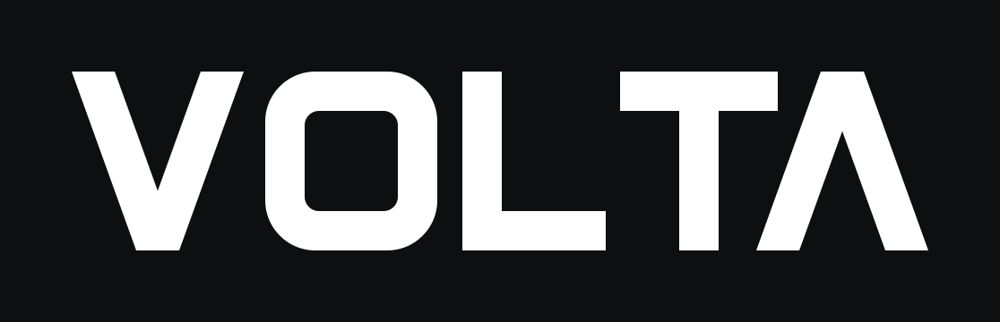
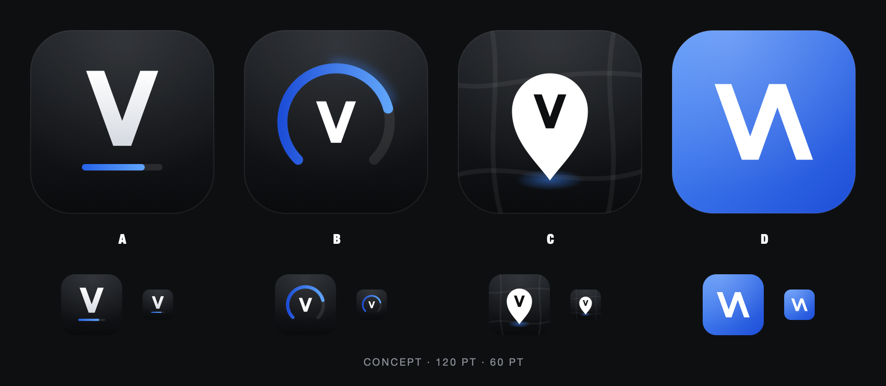

# Volta brand

Calm, dark, technical: white geometry on charcoal `#0E0F11`, with blue `#3B82F6`
as the only brand accent. Volta's marks are its own. Nothing here comes from
Wattly's logo or wordmark.

## Wordmark



- Source: [`wordmark.svg`](wordmark.svg), drawn from geometric shapes (no font dependency).
  The letters are 100 units tall with 22–24-unit stems, and the full mark has a 4.78:1 aspect ratio.
- The A has no crossbar. It mirrors the V, so the word opens and closes on the same chevron.
- In the app it's the `Wordmark` image set, an SVG with preserved vector data and
  template rendering. Tint it with `foregroundStyle`:

```swift
Image("Wordmark")
    .resizable()
    .scaledToFit()
    .frame(height: 20)            // width follows (≈ 96pt at 20pt tall)
    .foregroundStyle(.white)
    .accessibilityLabel("Volta")
```

## App icon concepts



| | Concept | Idea | Strengths | Weaknesses |
|---|---|---|---|---|
| **A** | Chevron + range bar | Large wordmark V over the dashboard's thin blue range bar (78% charged) | Matches the wordmark exactly. Echoes the app's own dashboard. Calm and premium. Holds up at 60pt | Quieter on a busy home screen |
| B | Charge ring | A 270° gauge, 78% filled, around a small V | Reads as battery or charge right away. Strongest blue presence | Gauge-ring icons are common (speedometers, fitness apps). The V gets small |
| C | Map pin | White pin with a V cutout over faint dark streets | Ties to the map hero and location history | Looks like a navigation or Maps app. The V is small at 60pt |
| D | VΛ waveform | The wordmark's V and Λ joined into one voltage-trace zigzag on a blue field | Most distinctive silhouette. Puts the name ("volt") in the mark | Bright blue breaks with the calm dark identity. Reads less clearly as a letter |

**Recommended: A.** It's the most ownable and the most consistent mark. It uses the
same V geometry as the wordmark and the same range-bar motif as the dashboard, and
it keeps the charcoal-and-blue restraint of the UI. The bar is 36/1024 thick so it
stays visible at home-screen size.

Sources: `icon-concepts/concept-{a,b,c,d}.svg` (1024×1024, full-bleed; iOS applies
the mask) with matching PNG renders. `comparison.svg` is self-contained.

## iOS icon set (`ios/Volta/Resources/Assets.xcassets/AppIcon.appiconset`)

The set is a single 1024 size with the iOS 18+/26 appearance variants:

| File | Appearance | Notes |
|---|---|---|
| `AppIcon.png` | Any / light | Opaque, no alpha (App Store requirement) |
| `AppIcon-Dark.png` | Dark | Transparent background, so the system supplies the dark backdrop. Slightly brighter bar |
| `AppIcon-Tinted.png` | Tinted | Opaque grayscale on black. The system maps luminance to the user's tint |

Sources are in `app-icon/icon{,-dark,-tinted}.svg`. This set is an asset catalog
icon, not an Icon Composer `.icon` file. iOS 26 renders it with the system Liquid
Glass treatment. If we later want layered glass, we can rebuild concept A in Icon
Composer from these SVG layers.

## Colors

| Asset | Value | Use |
|---|---|---|
| `AccentColor` | `#3B82F6` | App tint (SPEC blue). Wired through `NSAccentColorName` |
| `LaunchBackground` | `#0E0F11` | Launch screen background (SPEC charcoal) |

Wiring for the frame owner (`ios/project.yml` / Info.plist):

```yaml
settings:
  ASSETCATALOG_COMPILER_APPICON_NAME: AppIcon
  ASSETCATALOG_COMPILER_GLOBAL_ACCENT_COLOR_NAME: AccentColor
info:
  properties:
    UILaunchScreen:
      UIColorName: LaunchBackground
```

## Rendering

The PNGs come from the SVG sources via AppKit's native SVG loader:

```sh
swift docs/brand/tools/render.swift in.svg out.png 1024 [opaque]
```

`opaque` writes an RGB PNG with no alpha channel, which the primary app icon requires.
The catalog compiles cleanly with `actool` (Xcode, iOS 26 target): no warnings, all three
icon appearances present, and the wordmark stored as a vector.
